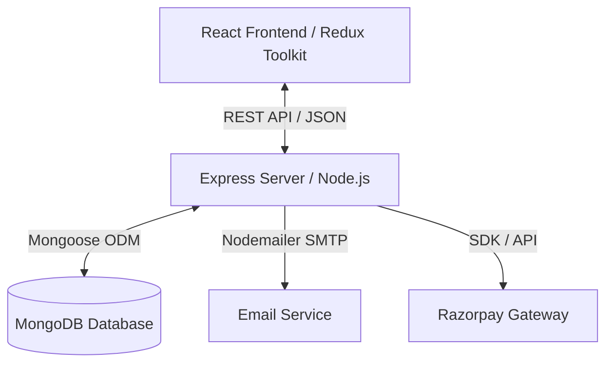

# System Architecture Documentation

This document describes the high-level architecture, directory layout, data design, and flow patterns of the Pizza Customization E-Commerce platform.

---

## 🏗️ Architectural Overview

The application is built using the standard MERN stack (MongoDB, Express, React, Node.js) with a clean separation of concerns between the client presentation layer and the API service layer.

---

## 📁 System Components

### 1. Presentation Layer (Frontend SPA)
The client layer resides in the `frontend` folder. It is compiled using Vite with Rolldown-vite configurations and styled with Tailwind CSS.
- **State Management**: Redux Toolkit manages auth states, shopping cart sessions, layout contexts, and order histories.
- **Routing**: React Router DOM handles protected routing for authentication states and administrator roles.
- **Components**:
  - `components/pages/`: Modular page views (Cart, Checkout, Customizer).
  - `components/PizzaVizualizer.jsx`: Live rendering SVG canvas that dynamically overlays toppings, crust styles, and sizing.

### 2. Business Logic & API Layer (Backend REST Service)
The server layer resides in the `backend` folder and runs on Node.js using Express.
- **Controllers**: Isolate database queries and payment gateway operations from request/response structures.
- **Middlewares**: Enforces security policies (Helmet, CORS), JWT parsing, role guards, and schema request body validations.
- **Models**: Defines strict schema validations for Order histories, Cart records, Pizzas, Toppings, and Users.

---

## 🔒 Security Architecture

The server incorporates several layers of defense-in-depth:
1. **Request Hashing & Validation**: Cryptographic payment signatures verification (SHA-256) protects against payment replay and tampering.
2. **Operational Error Handling**: Differentiates between client validation errors (operational) and system exceptions, preventing leaking internal server metadata or database query information.
3. **HTTP Hardening**: Enforces `helmet` standard headers, limits parameters using `hpp` (HTTP Parameter Pollution protection), and sanitizes mongo payloads using `express-mongo-sanitize` to block NoSQL Injection attacks.
